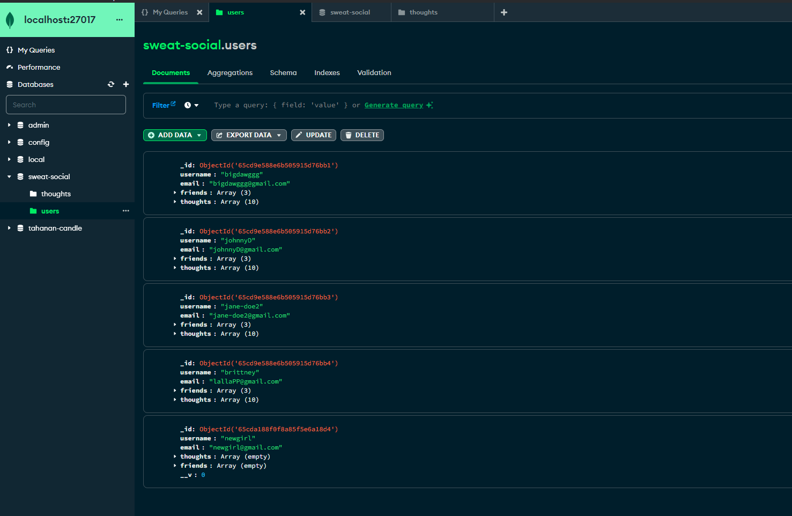
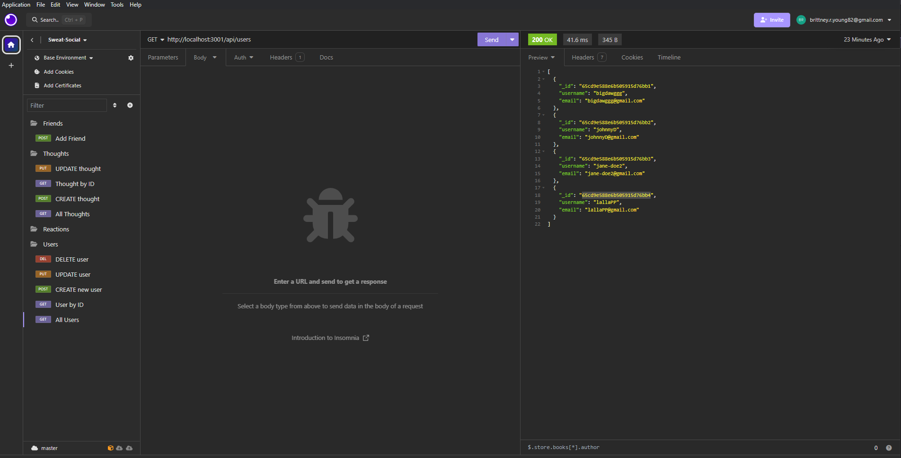
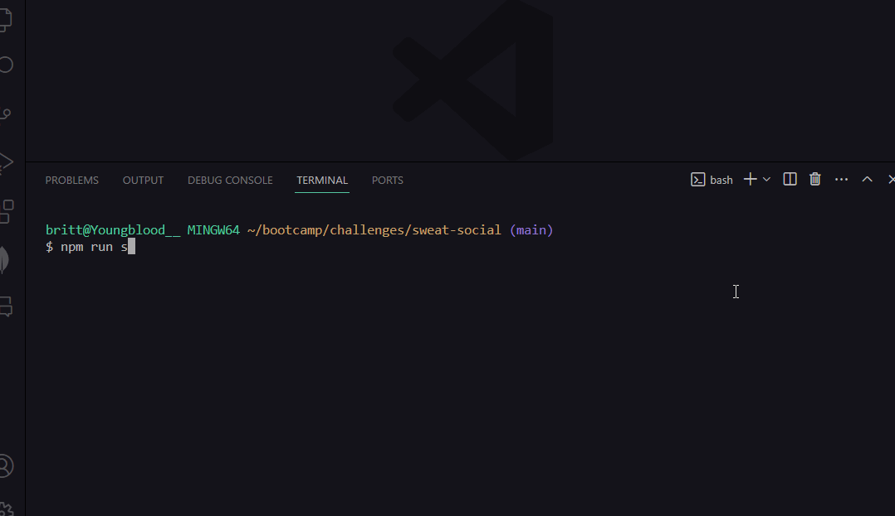

# sweat-social

Intended to be used in conjunction with a front-end developed app that allows gym users to find and meet up with fellow users and create a community of friends who enjoy fitness/health

## Description
NoSQL database API built to handle large amounts of unstructured data using Express.js, MongoDB, Mongoose ODM, and JavaScript's built-in object library.

AS A social media startup
I WANT an API for my social network that uses a NoSQL database
SO THAT my website can handle large amounts of unstructured data

## Table of Contents

If your README is long, add a table of contents to make it easy for users to find what they need.

- [Installation](#installation)
- [Usage](#usage)
- [Credits](#credits)
- [License](#license)

## Installation

Users will need to install:
-Express.js
-Mongoose

## Usage

- Clone git repository
- Run ```npm install```, ```npm run seed```, and ```npm run start```
- Start the server and use a tool for testing API endpoints (I recommend [Insomnia](https://insomnia.rest/download))
- Test the following endpoints:
  - GET routes to return all users and all thoughts
  - GET routes to return a single user and a single thought
  - POST, PUT, and DELETE routes for users
  - POST, PUT, and DELETE routes for thoughts
  - POST and DELETE routes for a user’s friend list
  - POST and DELETE routes for reactions to thoughts

e.g.








## Tests
Note: Additional testing/refactoring required

